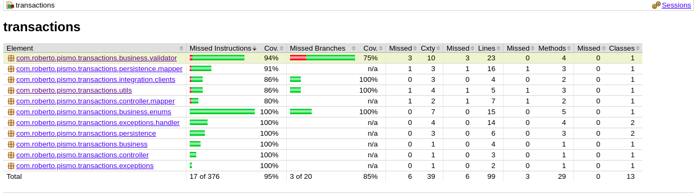

# 💻 Transactions Api

## 💻 Tecnologias utilizadas na construção

* Docker
* Docker Compose
* Spring Boot + Java 11
* Lombok
* JUnit para construção dos testes unitários
* JaCoCo para acompanhamento do coverage
* Feign foi utilizado como o cliente http
* Git + GitHub + GitHub Actions para CI/CD

## 🚜 Dependênias necessárias para execução

* Docker
* Docker Compose

## 🚀 Executando o micro serviço no Linux

* Primeiramente executar o projeto pismo-infra para criação da network docker para os micro serviços
* sudo start_docker_compose.sh

## ✅ Coverage atual do JaCoCO

## ♑ Insomnia requests

* O JSON contendo os requets para micro serviço podem ser encontrados dentro da pasta "insomnia"

